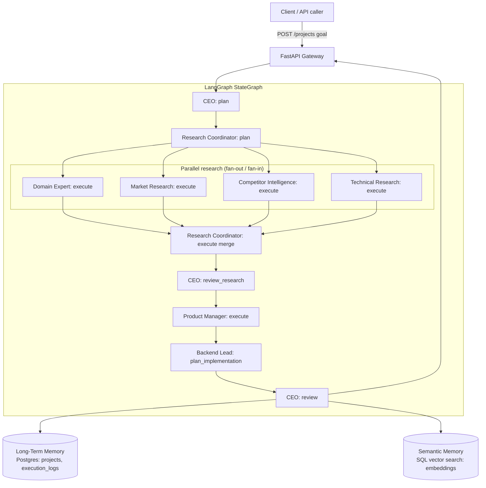

# Architecture

## What this is

This repository is a **working vertical slice** of the full AI Organization
(AIO) vision. Phase 1 proved the core pattern — *Executive AI orchestrates
specialist agents, and every run becomes reusable organizational memory* —
with one Executive AI delegating straight to Product and Engineering. Phase
2 (this update) inserts a **Research & Planning department** between the
Executive AI and Product Manager, so decisions are grounded in research
instead of assumptions: Product Manager can no longer generate requirements
from a raw goal, only from an Executive-reviewed research report.

See the [full master prompt](#relationship-to-the-full-aio-vision) below for
how this maps to the eventual 40-agent, multi-department platform.

## Current slice

(Source: [`docs/diagrams/architecture.mmd`](docs/diagrams/architecture.mmd).
Sequence diagram: [`docs/diagrams/sequence.mmd`](docs/diagrams/sequence.mmd).
Class diagram: [`docs/diagrams/classes.mmd`](docs/diagrams/classes.mmd).)

### Components

| Component | File | Role |
|---|---|---|
| Executive AI (CEO) | `src/aio/agents/executive.py` | Plans delegation, reviews research *and* final department output. Never implements. |
| Research Coordinator | `src/aio/agents/research_coordinator.py` | Breaks a goal into research objectives; merges the four specialists' findings into one `ResearchReport`. |
| Domain Expert | `src/aio/agents/domain_expert.py` | Industry/terminology/compliance/persona/KPI research. |
| Market Research Analyst | `src/aio/agents/market_research.py` | Target users, market size, pricing, trends research. |
| Competitor Intelligence Agent | `src/aio/agents/competitor_intelligence.py` | Competitor comparison, SWOT, feature-gap analysis. |
| Technical Research Agent | `src/aio/agents/technical_research.py` | Frameworks/cloud/APIs/feasibility research (not a build plan). |
| Product Manager | `src/aio/agents/product_manager.py` | Turns an Executive-approved `ResearchReport` into a `BusinessRequirementsDocument`. No longer accepts a bare goal. |
| Backend Lead | `src/aio/agents/backend_lead.py` | Turns a `BusinessRequirementsDocument` into a technical plan. |
| Orchestration graph | `src/aio/orchestration/graph.py` | LangGraph `StateGraph`: CEO → Research (parallel fan-out/fan-in) → CEO review → Product → Engineering → CEO review. |
| Data models | `src/aio/models/research.py`, `src/aio/models/product.py` | Pydantic contracts every agent hand-off uses instead of prose. |
| Observability | `src/aio/observability/execution_log.py`, `Agent.run_logged` | Per-call timing/confidence/error, logged always and persisted when memory is attached. |
| LLM connector | `src/aio/llm/anthropic_client.py` | The only wired-up provider. Thin wrapper so it's swappable. |
| Short-term memory | `src/aio/memory/short_term.py` | In-process context for a single run (not persisted). |
| Long-term memory | `src/aio/memory/long_term.py` | Postgres-backed system of record: projects + execution logs. |
| Semantic memory | `src/aio/memory/semantic.py` | Vector similarity search over past runs, backed by the same SQL database (cosine in NumPy) -- no separate vector-DB server. |
| Organizational Memory Foundation | `src/aio/models/memory.py`, `src/aio/memory/service.py` | `MemoryEntry`/`MemoryType`/`MemoryMetadata` + `MemoryService` (create/get/list only — see below). |
| Memory recording | `src/aio/memory/recording.py` | Derives durable `MemoryEntry` rows (research finding, risks) from a completed run and writes them via `MemoryService`. First writer into the memory foundation — see roadmap item #4. |
| API gateway | `src/aio/api/main.py` | FastAPI: submit a goal, fetch a past project, search by similarity, list execution logs. |

### Why these design choices

- **Parallel research via plain LangGraph fan-out/fan-in, no extra
  synchronization code.** The four research nodes share the same in-edge
  (`research_plan`) and out-edge (`research_merge`) with no edges between
  each other. LangGraph's Pregel executor runs same-superstep nodes
  concurrently and only fires a node once all its predecessors in that
  superstep have completed — so `research_merge` genuinely waits for all
  four specialists without a manual barrier. Verified in
  `tests/test_orchestration.py`.
- **The four research agents work directly from the goal, not chained.**
  The task spec's own detailed workflow describes them as parallel siblings
  under the Research Coordinator, not a Domain→Market→Competitor→Technical
  pipeline. A future refinement could feed Domain Expert's output to the
  other three for shared context — noted in the roadmap, not implemented
  yet, since it would break the parallel-independence property.
- **Confidence and reasoning are schema fields, not parsed markers.** Every
  research/product Pydantic model carries `confidence: float` and
  `reasoning_summary: str` as part of its normal JSON output, rather than a
  separate regex-extracted marker appended to free text. Simpler, and it's
  validated by the same Pydantic parse as everything else.
- **The Research Coordinator's merge call only asks the LLM to synthesize,
  not retranscribe.** `ResearchCoordinatorAgent.execute` has the model
  generate a small `ResearchSynthesis` (executive summary, opportunities,
  risks, assumptions, recommended direction) and attaches the four
  already-parsed leaf reports in Python (`ResearchReport.from_synthesis`).
  Asking a model to faithfully echo back large nested JSON it just received
  is wasteful and a common source of validation failures.
- **JSON parsing is centralized and defensive.**
  `agents/parsing.py::parse_json_response` strips an accidental markdown
  fence and raises a typed `AgentOutputParseError` (carrying the raw text)
  on either invalid JSON or a schema mismatch, instead of every agent
  reimplementing that.
- **No knowledge graph (Neo4j) yet.** The master prompt asks research
  memory to support "vector memory, knowledge graph, structured memory."
  This phase implements vector (SQL-backed cosine search) and structured
  (Postgres columns) memory for real. Standing up Neo4j with no real query
  pattern behind it
  yet would be infrastructure with nothing using it — the kind of hollow
  scaffolding this project has deliberately avoided since Phase 1. It's a
  named roadmap item, not a stub class pretending to be wired up.
- **`Agent.run_logged` is additive, not a rewrite of `run`.** Department
  leads that predate this lifecycle (Executive/Product Manager/Backend
  Lead) keep calling `run()`/`run_logged()` internally without changing
  their own public method names or signatures except where the task
  required it (see Breaking changes below).
- **One agent per department, not a squad.** The full vision has a Backend
  Lead *and* Backend Assistant *and* API Architect *and* Database Architect
  per department. This slice collapses each department to its lead (or, for
  Research, its four core specialists) so the orchestration pattern is
  provable without dozens of near-duplicate agent files.
- **Anthropic only.** `AnthropicClient` is the single LLM implementation;
  add a second provider by writing a class with the same
  `complete(system, user) -> str` shape.
- **Semantic memory still uses a placeholder embedder** (`default_hashing_embedder`
  in `semantic.py`) -- still a documented placeholder, not a real semantic
  embedding. It is now stored in the shared SQL database (one JSON vector per
  project, cosine similarity in NumPy at query time) rather than Qdrant: at
  this scale a brute-force scan is trivially fast and removes a whole
  vector-DB service and dependency. Swap `default_hashing_embedder` for a
  real provider and, if the row count ever outgrows a brute-force scan, an
  indexed vector store -- the `SemanticMemory` interface stays the same
  either way (only `semantic.py` changed for this swap).
- **No Kubernetes/Terraform/CI yet**, same reasoning as Phase 1.
- **Still no human-approval interrupt or feedback loop on CHANGES.**
  `research_approved` and `approved` are computed and stored precisely so
  that gate can be added later without touching anything upstream — see
  roadmap item 1.

### Organizational Memory Foundation

A `MemoryEntry` is a durable, addressable record of something the
organization learned, decided, or produced — a research finding, an
architectural decision, a lesson learned, a reusable component, a risk —
independent of the `Project` row that originated it. One project can
eventually spawn several memory entries; a `MemoryEntry` is not a
duplicate of `Project`.

This is a **foundation module only**, deliberately narrow in scope:

- **CRUD-only, on purpose.** `MemoryService` exposes exactly `create_entry`,
  `get_entry`, `list_entries(limit)` — no filtering by department/type/
  project, no relevance ranking. Anything beyond flat listing starts to be
  *retrieval*, which (along with a knowledge graph and any UI over this
  data) is explicitly deferred — see roadmap. `SemanticMemory` (vector
  search over *projects*) already exists separately and is unaffected by
  this module; the two are not merged.
- **Now wired into the pipeline (write side, roadmap item #4 step 1).**
  After a run completes, `run_organization` calls
  `memory/recording.py::record_project_memory`, which records the merged
  research report as a `RESEARCH_FINDING` and its identified risks as a
  consolidated `RISK` entry — both carrying the research report's *own*
  `confidence`, so no confidence value is fabricated. `ARCHITECTURAL_DECISION`
  recording (the roadmap's second named example) is deliberately deferred
  until the Backend Lead emits a structured output with a real confidence
  field; its tech plan is currently free text logged with `confidence=None`,
  and the recorder writes only entries whose confidence is a genuine signal.
  Each write emits a `knowledge_added` event (same contract
  `SemanticMemory.upsert_project` already uses) and is best-effort: a
  recording failure is logged but never loses the run that already persisted.
  Retrieval/filtering/knowledge-graph over these entries remain out of scope
  — still roadmap, see below. `GET /memory-entries` exposes them list-only,
  matching `MemoryService`'s CRUD-only surface.
- **Same storage layer, additive schema.** `MemoryEntryRecord` lives on the
  same shared `Base`/Postgres database as `Project`/`ExecutionLogRecord`
  (see `db/models.py`) — `MemoryService.init_schema()` only adds the new
  `memory_entries` table; nothing about `Project` or `ExecutionLogRecord`
  changed. `MemoryService` owns its own SQLAlchemy engine, mirroring
  `LongTermMemory`'s constructor pattern, rather than sharing a passed-in
  connection object.
- **`metadata_json`, not `metadata`, on the ORM model.** SQLAlchemy's
  `DeclarativeBase` reserves `metadata` for its own table-metadata
  registry, so `MemoryEntryRecord` can't have a mapped column literally
  named `metadata`. The Pydantic `MemoryEntry.metadata` field (as
  requested) is unaffected — `MemoryService` handles the
  serialize/deserialize mapping between the two names.
- **`created_at` is normalized to UTC-aware on read**, not just assumed.
  SQLite has no native tz-aware datetime type and silently drops `tzinfo`
  on round-trip (Postgres does not have this problem). Every value written
  is always UTC, so `MemoryService` re-attaches `timezone.utc` on read if a
  driver returned a naive datetime — caught by
  `test_create_entry_persists_and_round_trips`, which fails without this
  normalization.

### Breaking changes from Phase 1

Since this is still pre-production scaffolding with no real deployed data,
these were made directly rather than shimmed for backward compatibility:

- `ProductManagerAgent.define_requirements(goal, ceo_plan) -> str` was
  **removed**. Replaced by `ProductManagerAgent.execute(goal, research_report:
  ResearchReport) -> BusinessRequirementsDocument`. Product Manager can no
  longer act on a bare goal.
- `BackendLeadAgent.plan_implementation(requirements: str)` now takes a
  `BusinessRequirementsDocument` instead of a plain string.
- `LongTermMemory.save_project(...)` signature changed: `requirements: str`
  is gone, replaced by `research_report_json`, `research_review`,
  `research_approved`, and `business_requirements_json`.
- `Project.requirements` (DB column) is gone, replaced by
  `research_report_json` / `business_requirements_json`.
- `OrgState` (orchestration graph state) gained `ceo_plan`-adjacent research
  fields; `requirements: str` is gone from state, replaced by
  `business_requirements: BusinessRequirementsDocument`.

Additive, non-breaking: `Agent.__init__` gained an optional `long_term`
kwarg; `Agent` gained `input_schema`/`output_schema`/`run_logged`/generic
`plan`/`execute`/`review`/`handoff` hooks that existing department leads
don't have to implement.

## Roadmap: growing this into the full AIO vision

Ordered by what unlocks the most further work:

1. **Human-in-the-loop approval + feedback loop on CHANGES.** Use
   LangGraph's interrupt/checkpoint support so a CHANGES verdict (research
   *or* final review) pauses the graph for a human decision or routes back
   to the relevant department, instead of silently persisting anyway.
   `research_approved`/`approved` already exist for this gate to key off.
2. **Sequence Domain Expert before the other three researchers**, if
   research quality without shared context turns out to be a problem in
   practice (currently all four work independently from the raw goal).
3. **More departments as graph nodes.** Design (UI Designer), QA (Automation
   Tester), DevOps (Cloud Architect), Security Officer — each new
   department is a new `Agent` subclass plus a node/edge in `graph.py`. The
   pattern doesn't change.
4. **Wire `MemoryService` into the pipeline, then add retrieval, then a
   knowledge graph.** In that order: *(step 1 — done)* the pipeline now
   creates `MemoryEntry` rows automatically — Research Coordinator's merged
   report becomes a `RESEARCH_FINDING` and its risks a `RISK` entry (see
   `memory/recording.py`, exposed via `GET /memory-entries` and surfaced in
   the frontend's project-memory panel). Still ahead: Backend Lead recording
   `ARCHITECTURAL_DECISION`s (blocked on giving its tech plan a structured
   confidence — see the Organizational Memory Foundation note above); then
   filtering/relevance retrieval over `memory_entries` once there's real
   data to retrieve; then, once there's a real cross-project query need (e.g.
   "what technologies recur across approved research reports"), add Neo4j
   capturing relationships between entries, projects, and technologies — not
   just flat Postgres rows.
5. **Real embeddings provider** for `SemanticMemory`, replacing the hashing
   placeholder.
6. **Connector framework.** GitHub/Jira/Slack/etc. as swappable adapters
   behind a common interface, added one at a time as a department actually
   needs one.
7. **RBAC + auth** on the API gateway once more than one caller/department
   needs isolated access.
8. **CI/CD, k8s manifests, Terraform** once there's a real multi-service
   deployment topology to manage, not just `docker compose up`.
9. **Prompt/workflow evaluation loop** (Learning Division in the master
   prompt) — capture outcomes, score them, propose prompt changes, require
   human approval before they land. Now has real data to work from:
   `execution_logs` (confidence/duration/errors per agent call) and
   `research_approved`/`approved` outcomes per project.

## Relationship to the full AIO vision

The master prompt describes ~40 agents across 10 divisions, a full
knowledge-graph + vector-DB organizational brain, 20+ external connectors,
and enterprise deployment infra (k8s, Terraform, ArgoCD, Prometheus/Grafana).
That is a multi-quarter build for a real team. This repository is a growing
slice of it: Phase 1 proved Executive → Departments → Memory; Phase 2 proved
Executive → Research (parallel specialists) → Product → Engineering, with
observability threaded through every agent call. Each roadmap item above
extends this slice without changing its shape.
